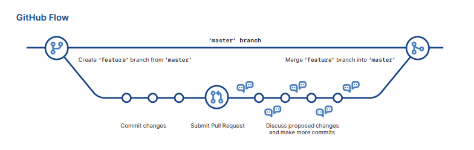

# Git-Github-Markdown-Learning-Archive
<br>
This repo is created for git-github  and markdown cheatsheet for who want to  recap or learn.

## Recommend Books
* [Pro Git](https://git-scm.com/book/tr/v2)
* [Beginning Git and Github](https://www.amazon.com/Beginning-Git-GitHub-Comprehensive-Management/dp/1484253124)

## Recommend Video Tutorials
* [Coding Train](https://www.youtube.com/playlist?list=PLRqwX-V7Uu6ZF9C0YMKuns9sLDzK6zoiV)

* [The Net Ninja](https://www.youtube.com/watch?v=3RjQznt-8kE&list=PL4cUxeGkcC9goXbgTDQ0n_4TBzOO0ocPR)


## How Git works ?
Look at IBM developer page => [How it works](https://developer.ibm.com/technologies/web-development/tutorials/d-learn-workings-git/)
## Workflow of GitHub



## Git States


##  Basics 
* Create empty Git repo in specified directory. Run with no
arguments to initialize the current directory as a git repository.
```
git init <directory>
```
<br></br>
* Clone repo located at repo onto local machine. Original repo can be
located on the local filesystem or on a remote machine via HTTP or SSH.
```
git clone <repo>
```
<br></br>
* Define author name to be used for all commits in current repo. Devs
commonly use --global flag to set config options for current user
```
git config user.name <name>
```

<br></br>
* Stage all changes in directory for the next commit.
Replace directory with a file to change a specific file.

```
git add <directory>
```
<br></br>
* Stage all changes in directory for the next commit.
Replace directory with a file to change a specific file.
```
git commit -m "<message>"
```
<br></br>
* List which files are staged, unstaged, and untracked

```
git status
```
<br></br>
* Display the entire commit history using the default format.
For customization see additional options.

```
git log 
```
<br></br>
* Show unstaged changes between your index and
working directory

```
git diff
```
<br></br>

## Undoing Changes

* Create new commit that undoes all of the changes made in
commit, then apply it to the current branch.
```
git revert <commit>
```
<br></br>

* Remove file from the staging area, but leave the working directory unchanged. This unstages a file without overwriting any changes.
```
git reset <file>
```
<br></br>

* Shows which files would be removed from working directory.
Use the -f flag in place of the -n flag to execute the clean

```
git clean -n
```
<br></br>

## Rewriting Git History

* Replace the last commit with the staged changes and last commit
combined. Use with nothing staged to edit the last commit’s message
```
git commit --amend
```
<br></br>
* Rebase the current branch onto base. base can be a commit ID, branch name, a tag, or a relative reference to HEAD.
```
git rebase <base>
```
<br></br>
* Show a log of changes to the local repository’s HEAD.
Add --relative-date flag to show date info or --all to show all refs
```
git reflog
```
<br></br>
## Git Branches

* List all of the branches in your repo. Add a branch argument to create a new branch with the name branch.

```
git branch
```
<br></br>
* Create and check out a new branch named branch.
Drop the -b flag to checkout an existing branch.
```
git checkout -b <branch>
```
<br></br>
* Merge branch into the current branch.

```
git merge <branch>
```
<br></br>
## Remote Repositories

* Create a new connection to a remote repo. After adding a remote, you can use name as a shortcut for url in other commands.

```
git remote add <name> <url>
```
<br></br>
* Fetches a specific <branch>, from the repo. Leave off <branch>
to fetch all remote refs.
```
git fetch <remote> <branch>
```
<br></br>
* Fetch the specified remote’s copy of current branch and
immediately merge it into the local copy.
```
git pull <remote>
```
<br></br>
* Push the branch to <remote>, along with necessary commits and
objects. Creates named branch in the remote repo if it doesn’t exist.
```
git push <remote> <branch>
```
<br></br>

## Git Config

* Define the author name to be used for all commits by the current user.

```
git config --global user.name <name>
```
<br></br>

* Define the author email to be used for all commits by the current user

```
git config --global user.email <email>
```
<br></br>

* Create shortcut for a Git command. E.g. alias.glog “log --graph
--oneline” will set ”git glog” equivalent to ”git log --graph --oneline.
```
git config --global alias. <alias-name> <git-command>
```
<br></br>

* Set text editor used by commands for all users on the machine. <editor> arg should be the command that launches the desired editor (e.g., vi)
```
git config --system core.editor <editor>
```
<br></br>

* Open the global configuration file in a text editor for manual editing.

```
git config --global --edit
```
<br></br>

## Git Log

* Limit number of commits by <limit>.
E.g. ”git log -5” will limit to 5 commits

```
git log --<limit>
```
<br></br>

* Condense each commit to a single line.
```
git log --oneline
```
<br></br>

* Display the full diff of each commit
```
git log -p
```
<br></br>

* Include which files were altered and the relative number of
lines that were added or deleted from each of them
```
git log --stat
```
<br></br>

* Search for commits by a particular author
```
git log --author= ”<pattern>”
```
<br></br>

* Search for commits with a commit message that
matches <pattern>.
```
git log --grep=”<pattern>”
```
<br></br>


* Show commits that occur between <since> and <until>. Args can be a commit ID, branch name, HEAD, or any other kind of revision reference.

```
git log <since>..<until>
```
<br></br>

* Only display commits that have the specified file.

```
git log -- <file>
```
<br></br>

* --graph flag draws a text based graph of commits on left side of commit msgs. --decorate adds names of branches or tags of commits shown.
```
git log --graph --decorate
```
<br></br>

# Git Diff

* Show difference between working directory and last commit
```
git diff HEAD
```
<br></br>

* Show difference between staged changes and last commit
```
git diff --cached
```

<br></br>

## Git Reset
* Reset staging area to match most recent commit,
but leave the working directory unchanged.
```
git reset
```
<br></br>

* Reset staging area and working directory to match most recent
commit and overwrites all changes in the working directory.
```
git reset --hard
```
<br></br>

* Move the current branch tip backward to <commit>, reset the
staging area to match, but leave the working directory alone.

```
git reset <commit>
```
<br></br>

## Git Rebase
* Interactively rebase current branch onto <base>. Launches editor to enter commands for how each commit will be transferred to the new base.
```
git rebase -i <base>
```
<br></br>

## Git Pull
* Fetch the remote’s copy of current branch and rebases it into the local copy. Uses git rebase instead of merge to integrate the branches.
```
git pull --rebase <remote>
```
<br></br>

## Git Push
* Forces the git push even if it results in a non-fast-forward merge. Do not use the --force flag unless you’re absolutely sure you know what you’re doing.
```
git push <remote> --force
```
<br></br>

* Push all of your local branches to the specified remote
```
git push <remote> --all
```
<br></br>


# Markdown Tutorial Links
1. [Github Docs](https://docs.github.com/en/github/writing-on-github/basic-writing-and-formatting-syntax)
2. [Interactive Tutorial](https://www.markdowntutorial.com/)
3. [Github Guiedes](https://guides.github.com/features/mastering-markdown/)
4. [Daring Fireball](https://daringfireball.net/projects/markdown/)
5. [Markdown Cheatsheet](https://github.com/adam-p/markdown-here/wiki/Markdown-Cheatsheet)
